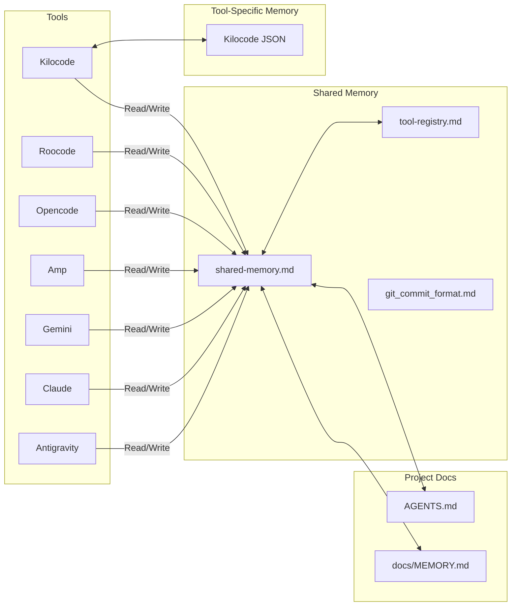

# Shared Memory System

This directory contains the consolidated memory pool that all AI tools (Kilocode, Roocode, Opencode, Amp, Gemini, Claude, Antigravity) use to maintain context across sessions.

## Purpose

The shared memory system provides:
- **Unified Context**: All tools share the same project understanding
- **Cross-Tool Continuity**: Work started in one tool can be continued in another
- **Consolidated History**: Single source of truth for project state
- **Tool Agnostic**: Works independently of any specific tool's internal memory system

## Files

| File | Purpose | Read By | Write By |
|------|---------|-----------|-----------|
 | [`shared-memory.md`](shared-memory.md) | Main shared memory pool | All tools | All tools |
 | [`tool-registry.md`](tool-registry.md) | Registry of AI tools and their memory systems | All tools | Tools discovering or updating registry |
 | [`git_commit_format.md`](git_commit_format.md) | Git commit message format specification | All tools | Opencode (maintainer) |
 | [`git_workflow_guide.md`](git_workflow_guide.md) | Git workflow & best practices | All tools | Opencode (maintainer) |
 | [`pull_request_guidelines.md`](pull_request_guidelines.md) | PR creation & review guidelines | All tools | Opencode (maintainer) |
 | [`README.md`](README.md) | This file - documentation for shared memory system | All tools | Opencode (maintainer) |

## Usage by AI Tools

### When Starting a Session

1. **Read Tool Registry**: Identify which tool you are, understand your capabilities
2. **Read Shared Memory**: Load recent entries, understand current state and pending tasks
3. **Read Tool-Specific Docs**: If your tool has internal memory, read that too
4. **Read Project Docs**: Check `AGENTS.md` and `docs/MEMORY.md` for context
5. **Report to User**: Confirm context loaded, list pending tasks, offer to continue

### During Work

1. **Update Shared Memory Incrementally**: Document decisions as they're made, not just at end
2. **Follow Decision Documentation Standards**: Explain **why**, not just **what**
3. **Keep Documentation Synced**: Update `docs/MEMORY.md` and other docs as needed
4. **Track Tool-Specific Patterns**: Document any tool-specific approaches or issues

### When Ending a Session

1. **Finalize Shared Memory Entry**: Document work completed, update task statuses
2. **Sync with Tool-Specific Memory**: If your tool has internal memory, sync relevant info
3. **Report Completion**: Summarize what was done, list incomplete items, suggest next steps

## Architecture



## Memory Entry Format

See [`shared-memory.md`](shared-memory.md) for the complete entry format. Each entry includes:

- **Timestamp**: When the work was done
- **Tool**: Which AI tool performed the work
- **Task Type**: Assigned Task, User-Directed Narrative, Discovery, Planning
- **Summary**: Brief description of what was done
- **Context**: Relevant background or previous state
- **Decisions Made**: Why certain approaches were chosen
- **Files Changed**: Which files were added, modified, or deleted
- **Tools Used**: MCP servers, external APIs, special commands
- **Outcome**: Result or status
- **Notes**: Additional context, issues, workarounds
- **Cross-Tool Context**: Information relevant to other tools
- **Related Entries**: Links to related memory entries

## Decision Documentation Standards

All tools must follow these standards when documenting decisions:

### What to Document

**DO document:**
1. **Design decisions and rationale**: Why you chose a specific approach
2. **Non-obvious implementation choices**: Trade-offs and alternatives considered
3. **Cross-file dependencies or contracts**: How components interact
4. **Performance considerations**: Why certain optimizations were made
5. **Security considerations**: Why certain security measures are in place
6. **Migration paths or backward compatibility**: How changes affect existing code

**DON'T document:**
1. **Obvious code**: Self-explanatory implementations
2. **What the code does**: Focus on **why**, not **what**
3. **Redundant type information**: Types are already in the code
4. **Outdated comments**: Remove or update outdated comments
5. **Workarounds that should be fixed**: Fix the issue instead of documenting a workaround

### Comment Format

**Use JSDoc for public APIs**:
```typescript
/**
 * Perform an operation with data
 * @returns Result of the operation
 */
async perform(data: Data): Promise<Result>
```

**Use inline comments for decision logic**:
```typescript
// Don't retry on authentication errors - they won't succeed
if (lastError instanceof Error && lastError.type === ErrorType.Authentication) {
  throw lastError;
}
```

**Use block comments for complex rationale**:
```typescript
/**
 * Design decision: Early return when no configuration is present to avoid unnecessary operations
 * Users expect the system to be silent until configured.
 */
private async initialize(): Promise<void> {
  const hasConfig = await this.configManager.hasConfig();
  if (!hasConfig) {
    this.statusIndicator.setIdle();
    return;
  }
  // ... rest of initialization
}
```

## Token Budget Management

All tools must manage their context budget carefully:

### File Reading Strategy

- **Read in chunks**: Maximum 500 lines per read operation
- **Use offset/limit**: For large files, read strategically
- **Summarize between chunks**: Understand what came before and after
- **Ask for continuation**: If more context is needed, ask user first

### Example

```typescript
// Don't do this - may exceed token limit
read(filePath)  // Reads entire file, could be 10,000+ lines

// Do this instead - read in chunks
read(filePath, offset=0, limit=500)   // First 500 lines
// Summarize logic, understand context
read(filePath, offset=500, limit=500)  // Next 500 lines
// Continue as needed
```

### Context Prioritization

1. **High Priority**: AGENTS.md, docs/MEMORY.md, docs/memory/shared-memory.md
2. **Medium Priority**: Project-specific docs (api.md, architecture.md, etc.)
3. **Low Priority**: Large source files (read only what's needed)

## Cross-Tool Handoff Process

When handing off work from one tool to another:

### First Tool (Handing Off)

1. **Update Shared Memory**:
   - Document what was completed
   - Note any incomplete work or blockers
   - Add cross-tool context for the next tool
   - Update task statuses (mark completed as "Complete")

2. **Provide Context**:
   - Summarize what was accomplished
   - List what's still incomplete
   - Note any specific approaches or patterns used
   - Suggest next steps

### Second Tool (Taking Over)

1. **Read Shared Memory**:
   - Check recent entries from the first tool
   - Understand the context and incomplete work
   - Note any tool-specific patterns or issues mentioned
   - Review related memory entries

2. **Acknowledge Handoff**:
   - Confirm understanding of previous work
   - Note any different approaches you might take
   - Continue from where the first tool left off
   - Maintain same task references (t6, t7, etc.)

## Conflict Resolution

When tools have conflicting approaches:

1. **Project Documentation Is Authoritative**: `AGENTS.md`, `docs/MEMORY.md`, `docs/architecture.md` take precedence
2. **Shared Memory Is Reference**: Use shared memory for current work context
3. **Tool-Specific Memory Is Supplemental**: Use for tool-specific patterns only
4. **Document Conflicts**: When you find conflicts, document them in shared memory
5. **Communicate with User**: If conflicts can't be resolved, ask for guidance

## Security Considerations

All tools must follow these security practices:

1. **Never Expose Secrets**:
   - API keys → `[API_KEY]`
   - Personal emails → `[USER_EMAIL]`
   - Credentials → `[CREDENTIAL]`
   - URLs with sensitive data → `[SENSITIVE_URL]`
   - File paths with personal info → `[PERSONAL_PATH]`

2. **Check Gitignore**:
   - Verify `.env` is ignored (contains test API key)
   - Verify `.mcp/` is ignored (contains MCP credentials)
   - Never commit sensitive data

3. **Review Before Committing**:
   - Check for accidentally included secrets
   - Check git diff for exposed credentials
   - Ask for review if unsure

## Version Control

All files in this directory are git-tracked:

- Commit changes with descriptive messages
- Example: `docs(memory): shared-memory - add entry for t6 progress bars implementation`
- Keep shared memory in sync with project work
- Reference memory entries in related commits

## Maintenance

### Adding New Tools

When a new AI tool starts working on this project:

1. **Add to Tool Registry** (`tool-registry.md`):
   - Tool name and status
   - Memory system location (if any)
   - Capabilities
   - Working patterns
   - Integration level

2. **Document Discovery Process**:
   - How the tool's memory was discovered
   - Any tool-specific patterns or conventions
   - How to integrate with shared memory

3. **Update This README** (if needed):
   - Add tool to architecture diagram
   - Update usage patterns
   - Document any special considerations

### Removing Tools

If a tool is no longer used:

1. **Update Tool Registry**: Mark tool as "Inactive" or remove
2. **Archive Relevant Entries**: Keep memory entries for historical reference
3. **Update Documentation**: Remove tool from architecture diagram if appropriate

## See Also

- [`AGENTS.md`](../AGENTS.md) - AI Agent Development Guide
- [`docs/MEMORY.md`](../MEMORY.md) - Query Memory & Task Tracking
- [`shared-memory.md`](shared-memory.md) - Main shared memory pool
- [`tool-registry.md`](tool-registry.md) - AI tool registry and capabilities
- [`git_commit_format.md`](git_commit_format.md) - Git commit message format
- [`git_workflow_guide.md`](git_workflow_guide.md) - Git workflow and best practices
- [`pull_request_guidelines.md`](pull_request_guidelines.md) - PR creation and review guidelines
